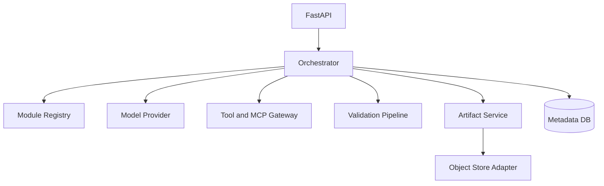

# Architecture

## Extension points

- `ModelProvider`: 接入 Azure OpenAI、内部 LLM Gateway 或本地模型。
- `ArtifactStore`: 接入 Azure Blob、S3、MinIO。
- `Tool`: 注册受控的本地或远程工具。
- `MCPClient`: 接入经过批准的 MCP Gateway。
- `Validator`: 增加产品规则、模拟器、编译器和一致性校验。
- `ModuleRegistry`: 当前基于文件，可替换为数据库和 GitOps Registry。

## Production evolution

1. 把同步 `Orchestrator` 节点迁移到持久化工作流引擎。
2. 每个 RunStep 增加幂等键、输入输出 Artifact 引用和 Trace ID。
3. 对 Tool/MCP 使用独立执行网关和沙箱。
4. 增加 OIDC、RBAC、ABAC、DLP、Secret Vault 和审计事件。
5. 增加 Golden Dataset、自动评测、Canary 和回滚。
