# AStudy 项目框架图与流程图

> 文档版本：v1.0  
> 项目基线：`https://github.com/hs205118/AStudy.git`  
> 文档用途：帮助开发者阅读现有代码、理解架构设计、定位调用关系，并指导后续演进  
> 图表格式：Mermaid

---

## 1. 项目总体心智模型

AStudy 当前由两个相互关联但职责独立的系统组成：

1. **TRD Agent Platform**：完成 TRD 输入、结构化提取、IR 审核、目标文件生成、校验与发布。
2. **AVF Automated Validation Framework**：完成环境准备、服务启动、自动测试、证据收集和报告生成。

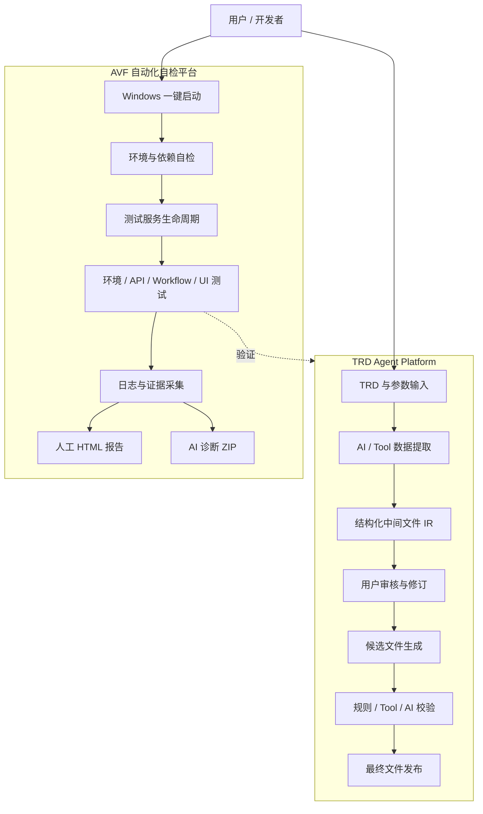

---

## 2. 当前项目目录与职责

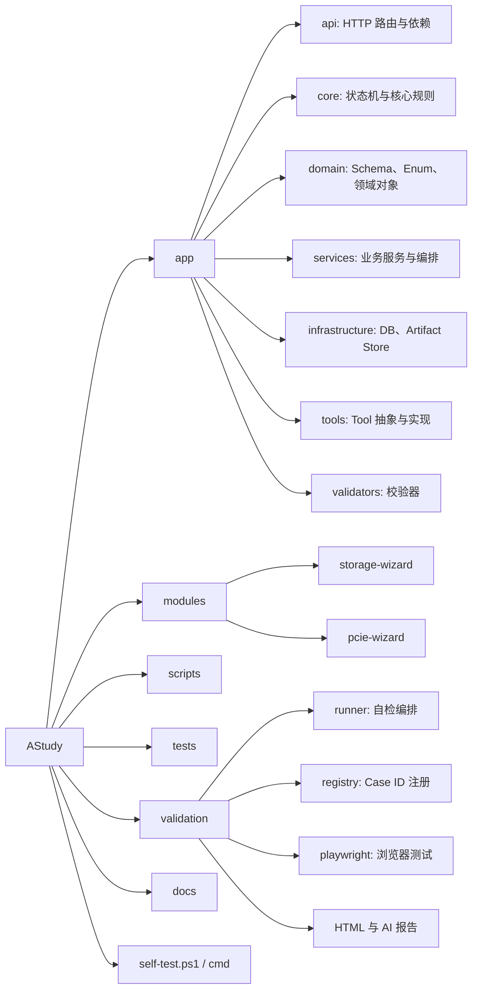

### 2.1 关键目录说明

```text
AStudy/
├── app/                         产品平台代码
│   ├── api/                     FastAPI 路由和依赖
│   ├── core/                    Run 状态机
│   ├── domain/                  Pydantic Schema 和枚举
│   ├── infrastructure/          数据库、Artifact Store
│   ├── services/                Run、Artifact、Module、Orchestrator
│   ├── tools/                   Tool Registry 与工具实现
│   └── validators/              Schema 与业务校验器
├── modules/                     领域模块定义
│   ├── storage-wizard/
│   └── pcie-wizard/
├── scripts/                     数据库初始化和演示脚本
├── tests/                       Python 单元测试
├── validation/                  AVF 自动化自检平台
├── self-test.ps1                Windows 一键自检入口
├── self-test.cmd                Windows 双击入口
├── pyproject.toml               Python 项目和依赖定义
└── .env.example                 环境变量模板
```

---

## 3. TRD Agent Platform 分层架构

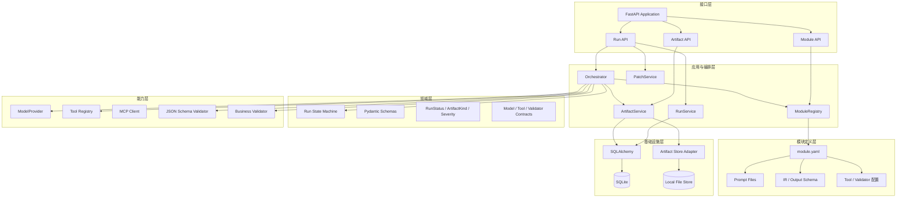

### 3.1 分层设计目的

```text
API 层             处理 HTTP 协议，不承载复杂业务
Service 层         封装可复用业务动作
Orchestrator       组织完整 Agent 流程
Domain 层          定义稳定规则、状态和数据契约
Capability 层      封装模型、Tool、MCP 和校验能力
Infrastructure 层  隔离数据库和文件存储实现
Module 定义层      通过配置扩展产品领域能力
```

---

## 4. FastAPI 启动流程

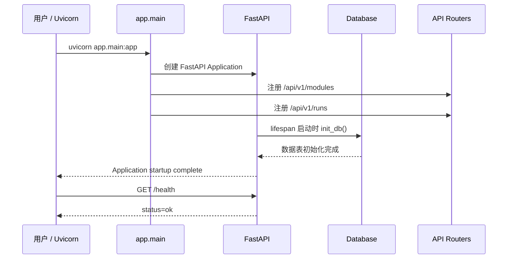

### 4.1 为什么 Uvicorn 能在手动 init_db 失败时启动

`python scripts/init_db.py` 可能因为 Python 导入路径不正确而失败，但 FastAPI 的 lifespan 仍会在服务启动时调用 `init_db()`。因此：

```text
手动脚本失败
≠
应用启动一定失败
```

后续建议统一使用：

```powershell
python -m scripts.init_db
```

或先执行：

```powershell
pip install -e .
```

---

## 5. 创建 Run 的请求调用链

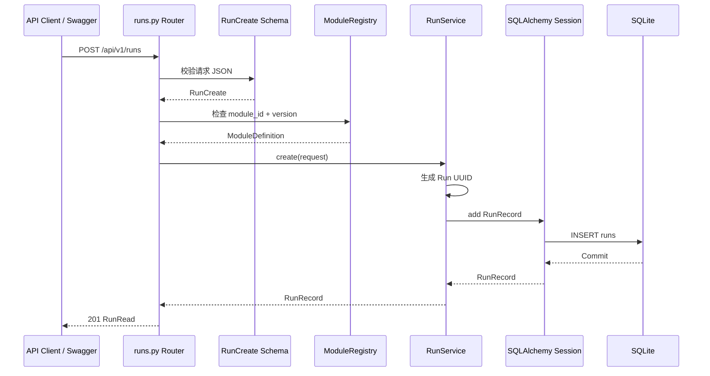

### 5.1 分层原因

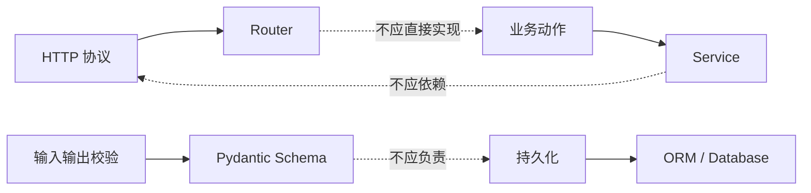

---

## 6. Run 状态机

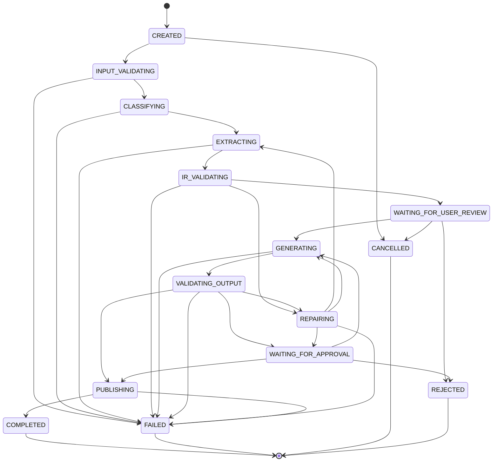

### 6.1 状态机解决的问题

```text
禁止 CREATED 直接变为 COMPLETED
禁止未生成 IR 就执行 Generate
禁止同一个完成任务被无限重复执行
明确失败、取消、拒绝和人工等待状态
为重试、恢复和审计提供基础
```

---

## 7. TRD 端到端 Agent 工作流

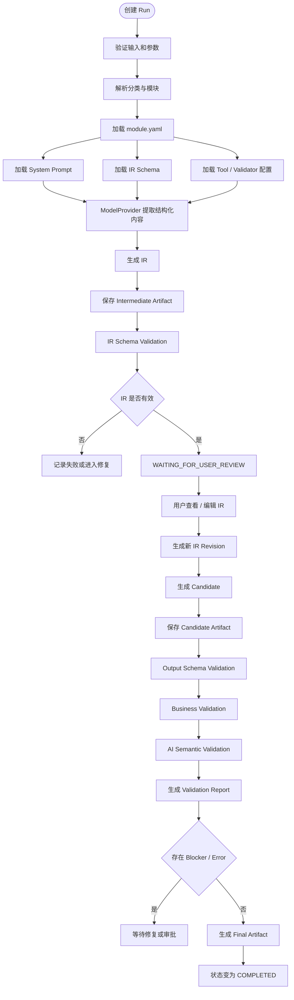

---

## 8. Execute 阶段调用流程

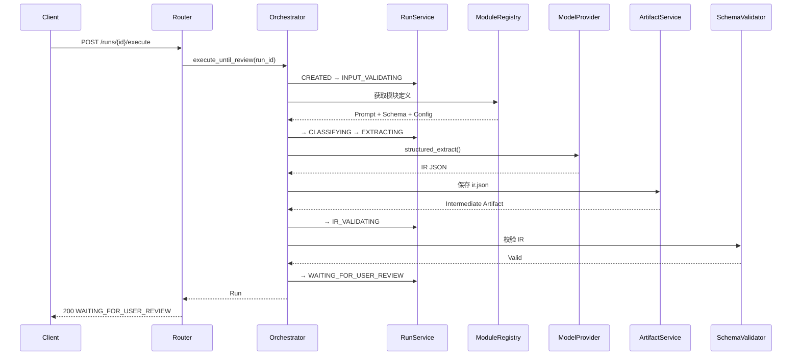

---

## 9. Generate 与 Validation 流程

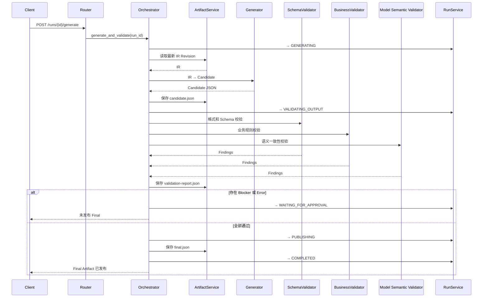

---

## 10. Module 模型

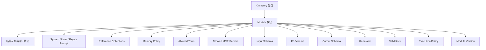

### 10.1 当前与目标状态

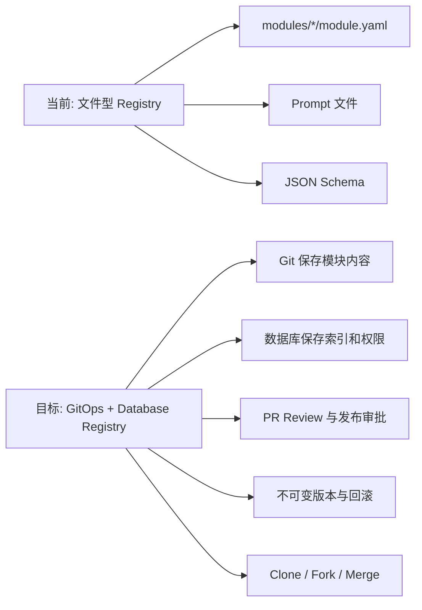

---

## 11. Prompt Bundle 目标架构

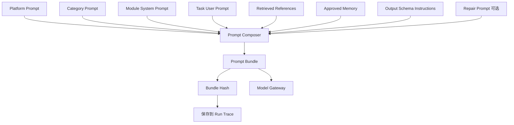

### 11.1 为什么需要 Bundle Hash

```text
可以复现某次 Run 使用的完整提示词
能够比较 Prompt 版本效果
支持 A/B 测试和回归评测
出现错误时可以定位具体 Prompt 组合
避免只记录单个 Prompt 文件版本而遗漏上下文
```

---

## 12. IR 设计与数据血缘

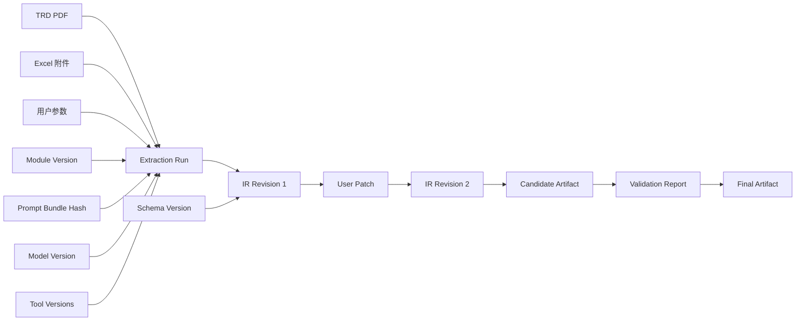

### 12.1 推荐的字段级来源结构

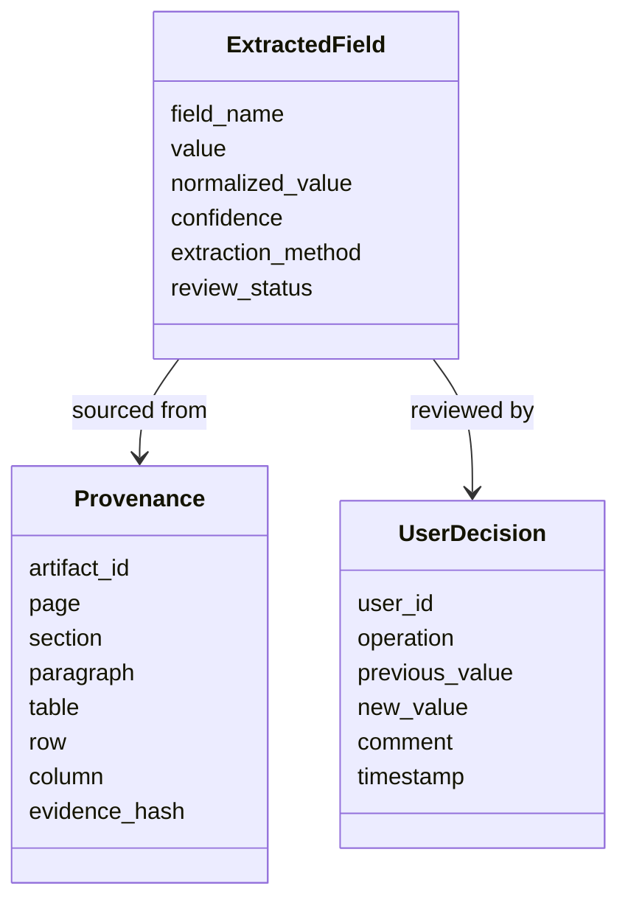

---

## 13. Artifact 存储架构

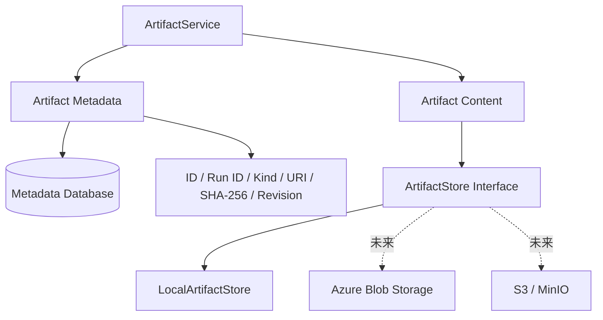

### 13.1 为什么文件与数据库分离

```text
数据库适合状态、索引、版本和关系
对象存储适合 PDF、Word、Excel、JSON、图片和日志
ArtifactStore 抽象使底层存储可以替换
SHA-256 用于完整性、缓存、审计和去重
```

---

## 14. Model Provider 与未来 Model Gateway

### 14.1 当前结构

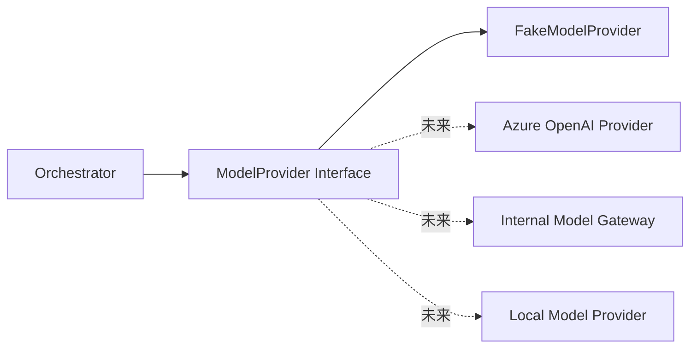

### 14.2 目标 Model Gateway

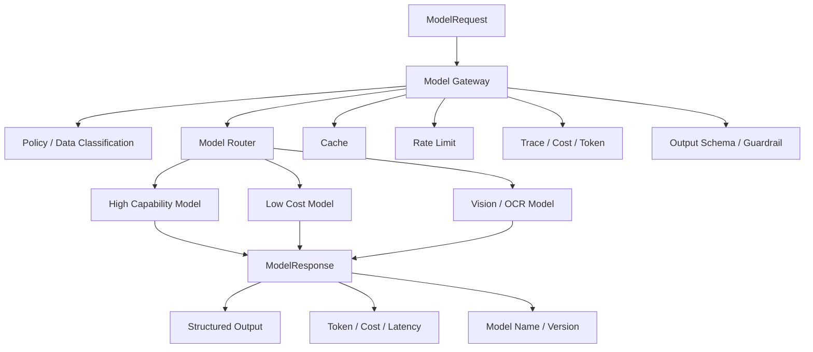

---

## 15. Tool 与 MCP 目标架构

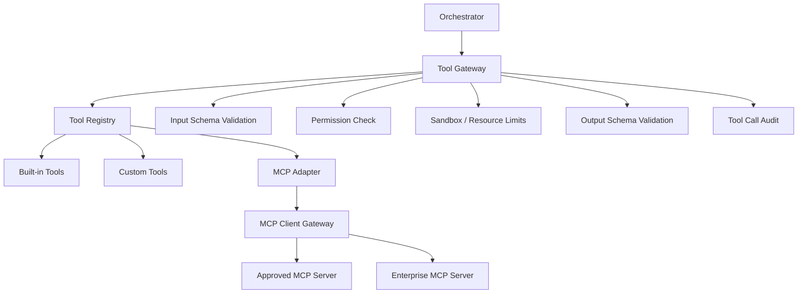

### 15.1 Tool 调用流程

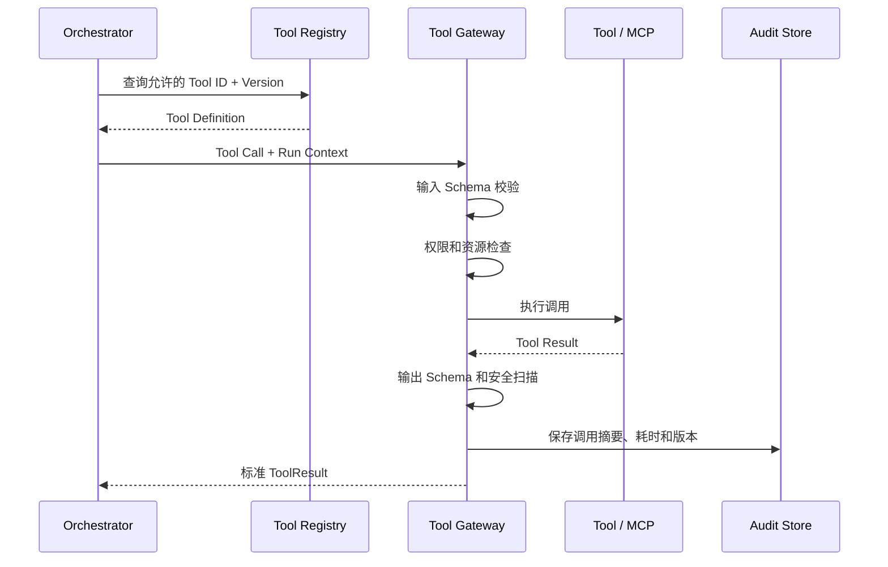

---

## 16. Validation Pipeline

```mermaid
flowchart LR
    Candidate[Candidate Artifact]
    Candidate --> Integrity[文件完整性]
    Integrity --> Syntax[语法 / 可解析性]
    Syntax --> Schema[JSON / XML Schema]
    Schema --> Business[业务规则]
    Business --> Tool[Tool / Simulator]
    Tool --> Semantic[AI 语义一致性]
    Semantic --> Aggregate[Finding 聚合]
    Aggregate --> Decision{质量门禁}

    Decision -- 通过 --> Publish[允许发布]
    Decision -- 不通过 --> Repair[自动修复候选]
    Decision -- 不通过 --> Review[人工处理 / Waiver]
```

### 16.1 确定性校验与 AI 校验边界

```mermaid
flowchart TB
    Validation[Validation]

    Validation --> Deterministic[确定性校验]
    Validation --> Semantic[AI 语义校验]

    Deterministic --> D1[必填字段]
    Deterministic --> D2[类型 / 枚举 / 范围]
    Deterministic --> D3[唯一性 / 引用完整性]
    Deterministic --> D4[编译 / 模拟 / 文件解析]

    Semantic --> S1[需求遗漏]
    Semantic --> S2[自然语言矛盾]
    Semantic --> S3[TRD 与输出意图一致性]
    Semantic --> S4[修复建议]
```

原则：**能够使用确定性规则验证的内容，不应只交给 AI 判断。**

---

## 17. AVF 自动化自检总体架构

```mermaid
flowchart TB
    Entry[self-test.ps1 / self-test.cmd]
    Bootstrap[Windows Bootstrap]
    PythonEnv[隔离 Python Virtual Environment]
    NodeEnv[Node / npm / Playwright]
    Runner[AVF Python Runner]
    Registry[Case Registry]
    Lifecycle[Service Lifecycle Manager]
    Product[AStudy Test Instance]
    Cases[Test Cases]
    Results[Canonical Results]
    HTML[Human HTML Report]
    ZIP[AI Diagnostic ZIP]

    Entry --> Bootstrap
    Bootstrap --> PythonEnv
    Bootstrap --> NodeEnv
    PythonEnv --> Runner
    NodeEnv --> Runner
    Runner --> Registry
    Runner --> Lifecycle
    Lifecycle --> Product
    Runner --> Cases
    Cases -.验证.-> Product
    Cases --> Results
    Results --> HTML
    Results --> ZIP
```

---

## 18. Windows 一键自检流程

```mermaid
flowchart TD
    A([运行 self-test.ps1]) --> B[定位项目根目录]
    B --> C[创建 .avf 目录]
    C --> D{隔离虚拟环境是否存在}
    D -- 否 --> E[创建 .avf/venv]
    D -- 是 --> F[复用虚拟环境]
    E --> G[安装 Python 项目依赖]
    F --> G

    G --> H{是否检测到 npm}
    H -- 是 --> I[npm install]
    I --> J[安装 Playwright Chromium]
    H -- 否 --> K[记录 Playwright 环境失败]

    J --> L[启动 AVF Python Runner]
    K --> L
    L --> M[创建隔离数据库与 Artifact Root]
    M --> N[选择随机空闲端口]
    N --> O[启动 Uvicorn 测试实例]
    O --> P[等待 /health Ready]
    P --> Q[执行环境 / API / Workflow 测试]
    Q --> R[执行 Playwright 测试]
    R --> S[停止 Uvicorn 和子进程]
    S --> T[生成 raw-results]
    T --> U[生成 HTML 报告]
    T --> V[生成 AI ZIP]
    U --> W[返回标准退出码]
    V --> W
```

---

## 19. AVF 测试层级

```mermaid
flowchart TB
    Doctor[环境与 Bootstrap 自检]
    Unit[Unit Tests]
    Component[Module / Tool / Validator Tests]
    API[API Contract Tests]
    Workflow[Agent Workflow Tests]
    Browser[Playwright E2E Tests]
    Evaluation[Golden Dataset Evaluation]

    Doctor --> Unit
    Unit --> Component
    Component --> API
    API --> Workflow
    Workflow --> Browser
    Workflow --> Evaluation
```

### 19.1 当前 Case ID 分类

```mermaid
mindmap
  root((AVF Case IDs))
    ENV
      Python
      Node
      npm
      Playwright
      文件权限
    APP
      Package Import
      Database Init
      Service Start
      Readiness
    API
      Health
      OpenAPI
      Modules
      Runs
    MOD
      Module Discovery
      Manifest Validation
    SCH
      IR Schema
      Output Schema
    WF
      Create Run
      Generate IR
      Validation
      Final Artifact
    UI
      Chromium
      Health Page
      Swagger
    AVF
      Registry
      Report Consistency
      Secret Redaction
      Cleanup
```

---

## 20. AVF 报告生成流程

```mermaid
flowchart LR
    Cases[Test Execution]
    Cases --> Events[Case Results / Events]
    Events --> Store[Canonical Result Store]

    Store --> Summary[summary.json]
    Store --> CaseJSON[cases.json]
    Store --> Failures[failures.json]
    Store --> Evidence[Logs / HTTP / Screenshots / Trace]

    Summary --> HTMLBuilder[HTML Report Builder]
    CaseJSON --> HTMLBuilder
    Evidence --> HTMLBuilder
    HTMLBuilder --> Human[index.html]

    Summary --> AIBuilder[AI Package Builder]
    CaseJSON --> AIBuilder
    Failures --> AIBuilder
    Evidence --> AIBuilder
    AIBuilder --> AIZip[AStudy_AVF Run ZIP]
```

### 20.1 人工 HTML 报告布局

```text
┌──────────────────────────────────────────────────────────┐
│ AStudy AVF | Run ID | Status | Duration | Commit         │
├─────────────────┬────────────────────────────────────────┤
│ Dashboard       │ 总体状态卡片                           │
│ Environment     │                                        │
│ Application     │ 测试列表                               │
│ Database        │                                        │
│ API             │ Case ID / 状态 / 耗时                  │
│ Module          │                                        │
│ Workflow        │ 日志 / Stack Trace / Evidence          │
│ Playwright      │                                        │
│ Validation      │ Screenshot / Trace / Artifact           │
└─────────────────┴────────────────────────────────────────┘
```

---

## 21. Playwright 测试流程

```mermaid
sequenceDiagram
    participant AVF as AVF Runner
    participant NPM as npm / npm.cmd
    participant PW as Playwright
    participant Browser as Chromium
    participant App as AStudy Test Instance
    participant Log as Evidence Store

    AVF->>NPM: npm test
    NPM->>PW: 执行 Playwright Config
    PW->>Browser: 启动隔离 Browser Context
    Browser->>App: 打开 /health
    App-->>Browser: 200 status=ok
    Browser->>App: 打开 /docs
    App-->>Browser: Swagger HTML
    Browser-->>PW: Assertions
    PW-->>NPM: Exit Code + stdout + stderr
    NPM-->>AVF: Process Result
    AVF->>Log: 保存 Command / Exit Code / stdout / stderr
    AVF->>Log: 保存失败 Screenshot / Trace / Video
```

---

## 22. 当前代码阅读顺序

```mermaid
flowchart TD
    A[1. README.md]
    B[2. pyproject.toml / .env.example]
    C[3. app/main.py]
    D[4. app/api/routes/runs.py]
    E[5. app/domain/schemas.py]
    F[6. app/services/run_service.py]
    G[7. app/infrastructure/database.py]
    H[8. app/core/state_machine.py]
    I[9. app/services/module_registry.py]
    J[10. modules/storage-wizard]
    K[11. app/services/orchestrator.py]
    L[12. app/services/model_provider.py]
    M[13. app/services/artifact_service.py]
    N[14. app/validators]
    O[15. app/tools]
    P[16. self-test.ps1]
    Q[17. validation/runner/cli.py]
    R[18. validation/registry/cases.json]
    S[19. validation/playwright]

    A --> B --> C --> D --> E --> F --> G --> H --> I --> J --> K --> L --> M --> N --> O --> P --> Q --> R --> S
```

### 22.1 阅读每个文件时的问题模板

```text
1. 这个文件在系统中的角色是什么？
2. 谁调用它？
3. 它又调用谁？
4. 它接收什么输入？
5. 它输出什么结果？
6. 它是否承担了不属于自己的职责？
7. 它是否容易进行单元测试？
8. 它依赖的是接口还是具体实现？
9. 出错后在哪里记录？
10. 对应哪一个 AVF Case ID？
```

---

## 23. 当前 Orchestrator 的重构方向

### 23.1 当前结构

```mermaid
flowchart TD
    Router --> Orchestrator
    Orchestrator --> ModuleRegistry
    Orchestrator --> ModelProvider
    Orchestrator --> ArtifactService
    Orchestrator --> SchemaValidator
    Orchestrator --> StorageValidator
    Orchestrator --> RunService
```

当前问题：Candidate 生成、Validator 选择、流程状态和领域规则仍有部分硬编码。

### 23.2 目标节点化架构

```mermaid
flowchart LR
    Start([Run Start])
    InputNode[InputValidationNode]
    ModuleNode[ModuleResolutionNode]
    ContextNode[ContextBuildNode]
    ExtractionNode[ExtractionNode]
    IRNode[IRValidationNode]
    ReviewNode[HumanReviewNode]
    GenerationNode[GenerationNode]
    ValidationNode[OutputValidationNode]
    RepairNode[RepairNode]
    PublishNode[PublishingNode]
    OptimizeNode[OptimizationProposalNode]
    End([Completed])

    Start --> InputNode --> ModuleNode --> ContextNode --> ExtractionNode --> IRNode --> ReviewNode --> GenerationNode --> ValidationNode
    ValidationNode -- 通过 --> PublishNode --> OptimizeNode --> End
    ValidationNode -- 可修复 --> RepairNode --> GenerationNode
    ValidationNode -- 需人工 --> ReviewNode
```

---

## 24. RunStep 目标数据模型

```mermaid
erDiagram
    RUN ||--o{ RUN_STEP : contains
    RUN ||--o{ ARTIFACT : produces
    RUN_STEP ||--o{ MODEL_CALL : invokes
    RUN_STEP ||--o{ TOOL_CALL : invokes
    RUN_STEP ||--o{ VALIDATION_RUN : triggers
    ARTIFACT ||--o{ ARTIFACT_REVISION : versions
    VALIDATION_RUN ||--o{ VALIDATION_FINDING : reports
    ARTIFACT_REVISION ||--o{ USER_PATCH : modified_by
    RUN ||--o{ AUDIT_EVENT : records

    RUN {
        string id
        string status
        string module_id
        string module_version
    }

    RUN_STEP {
        string id
        string step_type
        string status
        int attempt
        datetime started_at
        datetime finished_at
    }

    MODEL_CALL {
        string model
        string prompt_bundle_hash
        int input_tokens
        int output_tokens
        decimal cost
    }

    TOOL_CALL {
        string tool_id
        string tool_version
        string status
        int duration_ms
    }
```

---

## 25. Memory 自学习闭环

```mermaid
flowchart TD
    RunData[Run Trace]
    Patch[用户 IR Patch]
    Findings[Validation Findings]
    Review[Review Comments]

    RunData --> Analyze[失败模式分析]
    Patch --> Analyze
    Findings --> Analyze
    Review --> Analyze

    Analyze --> PromptCandidate[Prompt 优化建议]
    Analyze --> MemoryCandidate[Memory Candidate]
    Analyze --> ToolCandidate[Tool 改进建议]
    Analyze --> SchemaCandidate[Schema 改进建议]

    PromptCandidate --> Eval[离线评测]
    MemoryCandidate --> Eval
    ToolCandidate --> Eval
    SchemaCandidate --> Eval

    Eval --> Gate{是否优于基线}
    Gate -- 否 --> Reject[拒绝或继续优化]
    Gate -- 是 --> Human[人工审核]
    Human --> Canary[Canary]
    Canary --> Monitor[质量 / 成本 / 延迟监控]
    Monitor --> Publish[发布新版本]
    Monitor --> Rollback[质量回退时回滚]
```

原则：**学习结果先成为 Candidate，禁止直接修改生产 Prompt、Memory、Tool 或 Schema。**

---

## 26. 推荐开发路线图

```mermaid
flowchart LR
    P1[阶段 1: 稳定当前 MVP]
    P2[阶段 2: RunStep 与审计]
    P3[阶段 3: Prompt Registry]
    P4[阶段 4: IR Review 与 Revision]
    P5[阶段 5: Tool Registry]
    P6[阶段 6: MCP Gateway]
    P7[阶段 7: Reference / RAG]
    P8[阶段 8: Memory Service]
    P9[阶段 9: Evaluation / Self-learning]
    P10[阶段 10: Web Console]

    P1 --> P2 --> P3 --> P4 --> P5 --> P6 --> P7 --> P8 --> P9 --> P10
```

### 26.1 各阶段主要交付物

```text
阶段 1
- 拆分 AVF Runner
- 修复 Windows 与 Playwright 稳定性
- 完善测试 ID 和报告证据

阶段 2
- RunStep
- ModelCall
- ToolCall
- AuditEvent
- Checkpoint 与 Retry

阶段 3
- PromptComponent
- PromptVersion
- PromptBundle
- Bundle Hash
- A/B Evaluation

阶段 4
- IRRevision
- UserPatch
- ReviewTask
- Approval / Rejection / Waiver

阶段 5
- ToolDefinition
- ToolVersion
- Input / Output Schema
- Permission 和 Sandbox

阶段 6
- MCP Registry
- MCP Gateway
- MCP Permission
- MCP Call Audit

阶段 7
- Reference Collection
- Document Version
- Chunk Provenance
- Retriever / Reranker

阶段 8
- Memory Candidate
- Scope
- Review
- Expiration
- Usage Tracking

阶段 9
- Golden Dataset
- Evaluation Runner
- Baseline Comparison
- Canary / Rollback

阶段 10
- Module Management
- Run Workspace
- IR Editor
- Validation Viewer
- AVF Report Viewer
```

---

## 27. 推荐学习路线

```mermaid
journey
    title AStudy 架构学习路线
    section 基础入口
      阅读 README 和配置: 5: 学习者
      启动 FastAPI 与 Swagger: 5: 学习者
      跟踪创建 Run API: 4: 学习者
    section 核心领域
      理解状态机: 5: 学习者
      理解 Module Registry: 4: 学习者
      理解 IR 与 Artifact: 5: 学习者
      跟踪 Orchestrator: 4: 学习者
    section 扩展能力
      理解 Model Provider: 4: 学习者
      理解 Validator 和 Tool: 4: 学习者
      设计 MCP Gateway: 3: 学习者
    section 质量体系
      执行 AVF 自检: 5: 学习者
      阅读 HTML 和 AI 报告: 4: 学习者
      增加新 Case ID: 4: 学习者
    section 架构演进
      重构 RunStep: 3: 学习者
      建设 Prompt Registry: 3: 学习者
      建设 Memory 与 Evaluation: 2: 学习者
```

---

## 28. 架构设计原则总结

```mermaid
mindmap
  root((AStudy 设计原则))
    模块化
      平台与领域模块分离
      Prompt Tool Validator 可替换
    可追溯
      Artifact 血缘
      Prompt Bundle Hash
      Model Tool Version
    人机协同
      IR Review
      Revision
      Approval
    验证优先
      Schema
      Business Rules
      Tool
      AI Semantic Check
    安全扩展
      Tool Permission
      MCP Gateway
      Sandbox
      Secret Redaction
    受控学习
      Candidate
      Evaluation
      Review
      Canary
      Rollback
    自动化质量
      Stable Case ID
      Windows One-click Test
      HTML Report
      AI Diagnostic ZIP
```

---

## 29. 建议的下一次代码阅读课程

建议下一步从 `app/main.py` 开始，依次阅读：

```text
app/main.py
→ app/api/routes/runs.py
→ app/domain/schemas.py
→ app/services/run_service.py
→ app/infrastructure/database.py
```

每次课程采用固定结构：

```text
文件角色
→ 逐段代码解释
→ 调用关系
→ 为什么这样设计
→ 当前优点
→ 当前问题
→ 生产化改造
→ 小练习
→ 对应 AVF Case ID
```

这样可以从“能够运行项目”逐步提升到“能够为项目做架构决策”。
